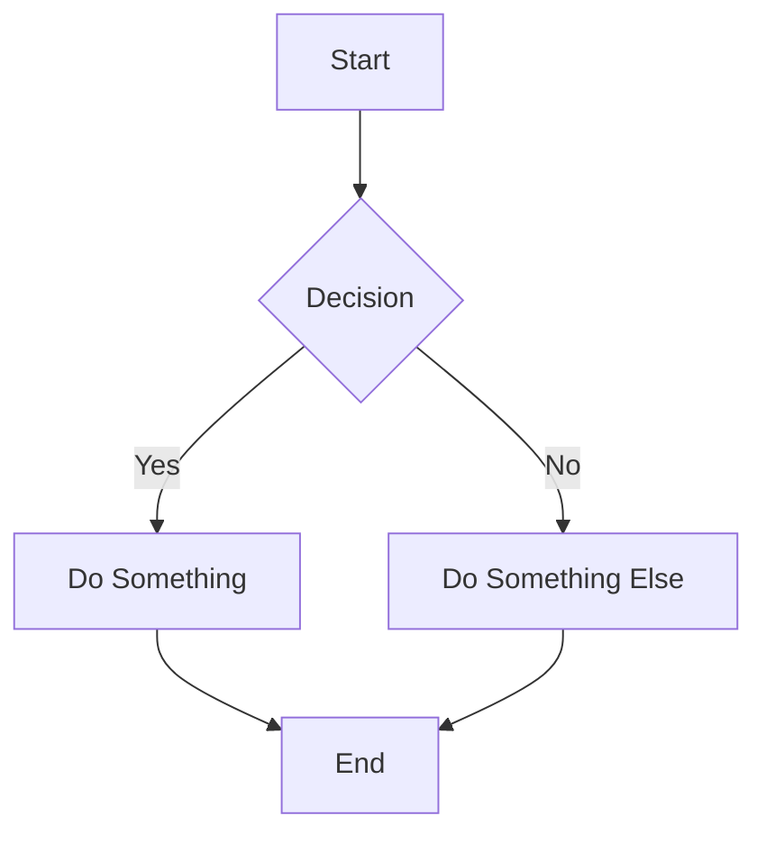
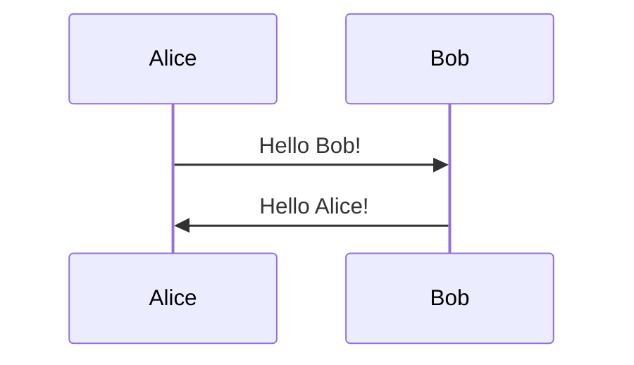

# Mermaid Diagrams

## Mermaid Diagrams

````markdown

```mermaid
graph TD
    A[Start] --> B{Decision}
    B -->|Yes| C[Do Something]
    B -->|No| D[Do Something Else]
    C --> E[End]
    D --> E
```


```mermaid
sequenceDiagram
    participant A as Alice
    participant B as Bob
    A->>B: Hello Bob!
    B->>A: Hello Alice!
```
`````
